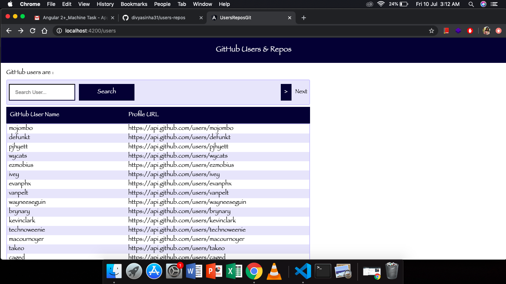
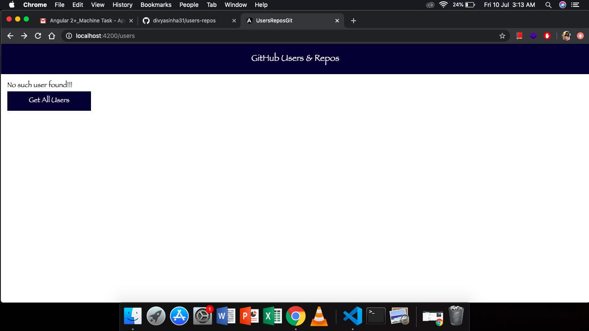
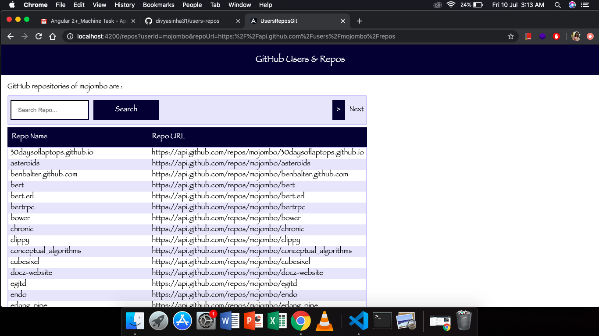
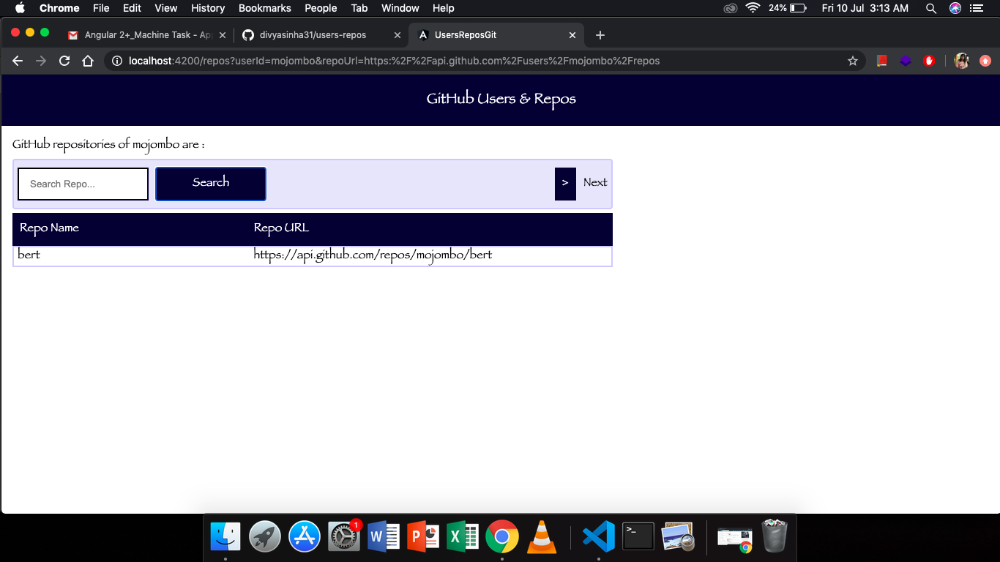
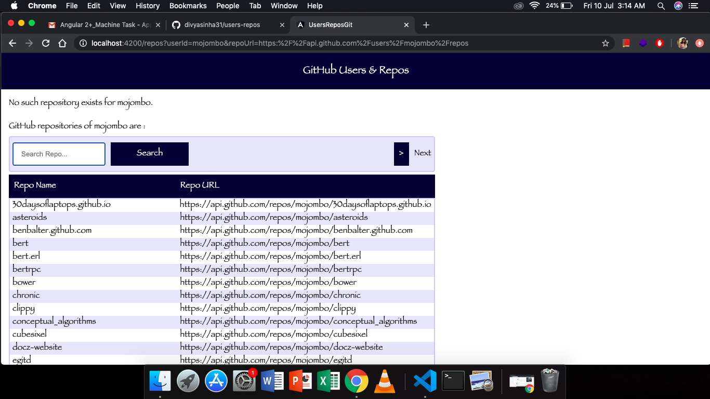

# Users - Repos

# About

A small application that looks into the REST Apis of GitHub

## How To Run The App

Run `ng serve` for a dev server. Navigate to `http://localhost:4200/`. The app will automatically reload if you change any of the source files.

## App Features

1. List all GitHub users
2. Search a particular user
3. List all repositories of a particular user
4. Search a particular repository for a particular user

## App Screens

1. 
2. 
3. 
4. 
5. 
6. 